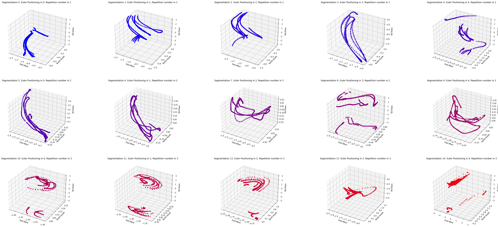
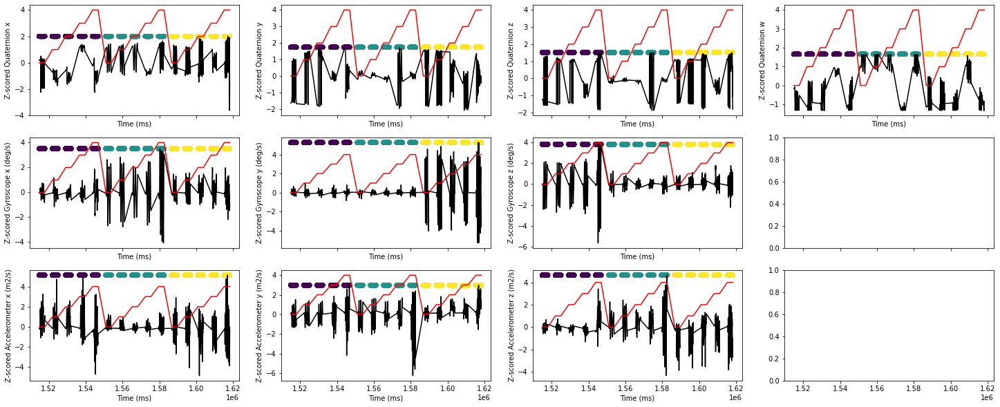
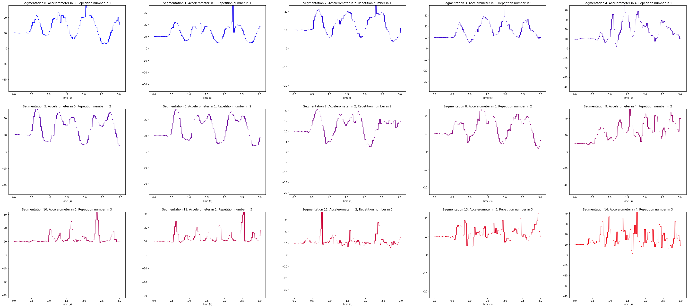
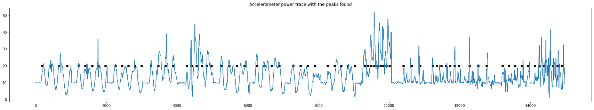
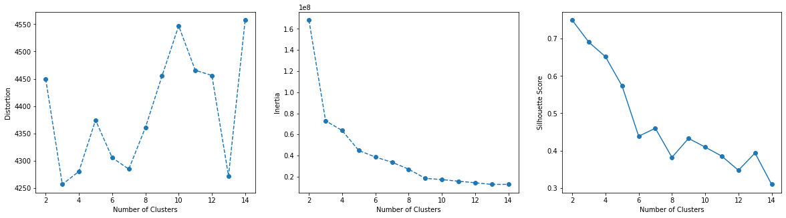
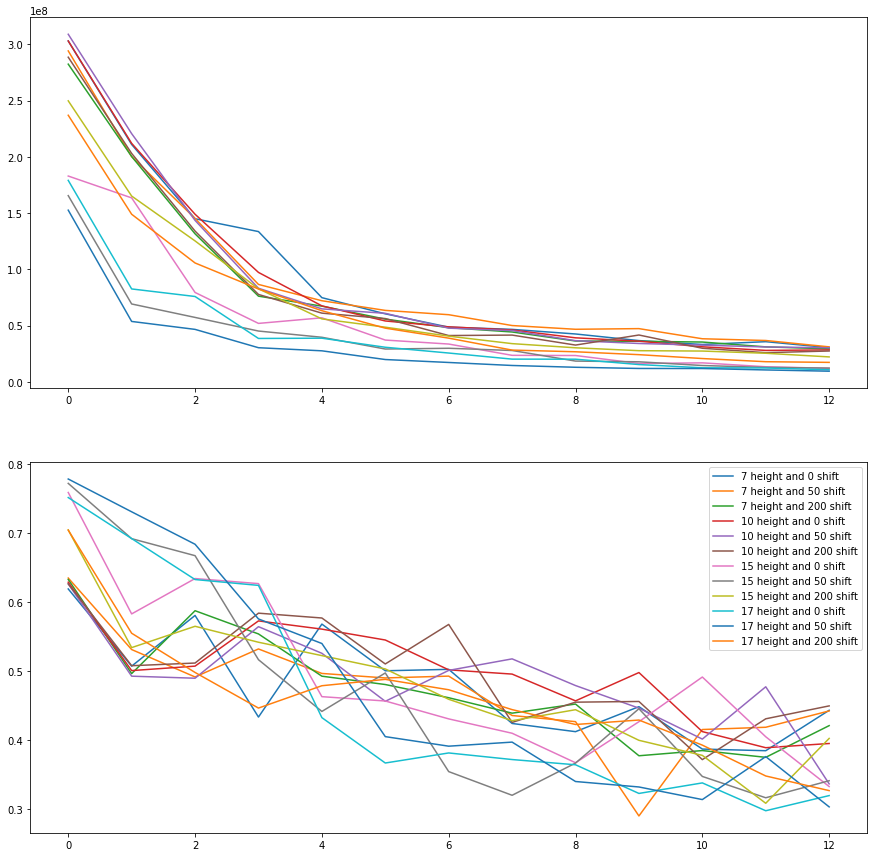
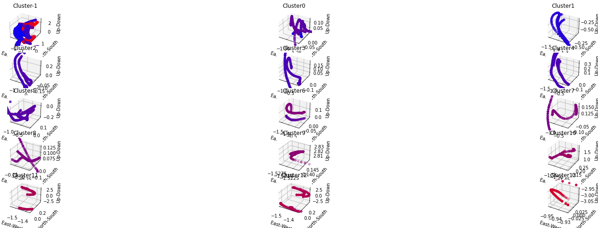
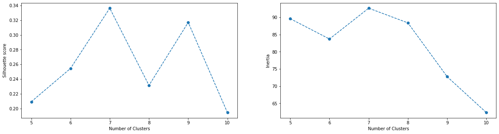
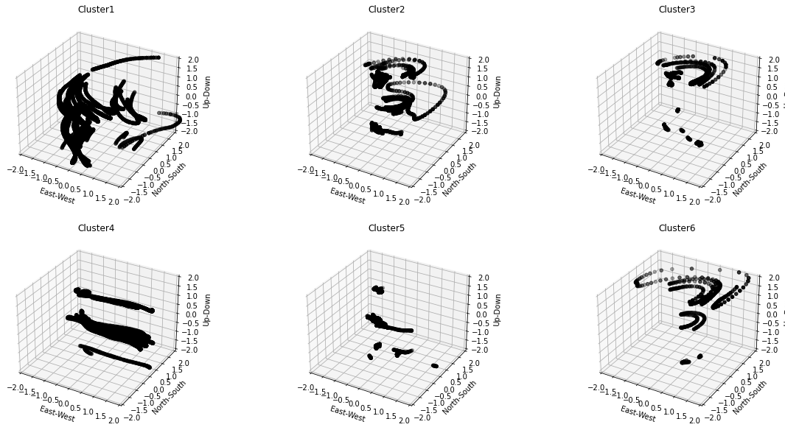
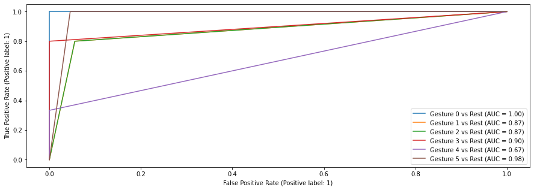

# Pison Report:
Highlights: https://github.com/gerardoRO/Pison
* 6 gestures identified with K Means clustering
* XGBoost Classifier returns an F1 score of 84% in the classification.
* Extendable function library that can be augmented for deeper analysis.

## Introduction
### GOAL: Identify number of gestures during each body motion, and attempt to classify them as well. 

### Initial thoughts from instructions
* Body motion will be a method by which we will separate data. We want to identify number of gestures and generate a classification of these gestures.
* This project will require unsupervised learning techniques, since it appears we don't know what is a gesture, or even how many we have.
* Quaternion and accelerometer/gyroscope data have different axis.The quaternion appears to be negative of the other values.
* I'm unfamiliar with quaternion/gyroscope processing, so let's look a bit into that as well.

### Pipeline of expected steps to address our problems

Step 1: Look at raw data to get an idea of what we are working with.

Step 2: Create a dataset where each row corresponds to a sample. Currently time is our index but need to switch to some broader dynamics, since we have time-series components and that can provide contextual information. Ideally each sample would be a gesture, but we have to identify what a "gesture" is.

Step 3: Augument dataset. We can abstract properties from the time series dataset into frequency domains or other components that we can look into later. 
Ideally through this augmentation we can find some deeper higher dimensional properties that allow us to group things easier.

Step 4: Perform decomposition of our dataset to see if we can observe clustering of different groups, which might hint at different gestures.

Step 5: Attempt to classify different groups.

### 1. Data Exploration
<b>Goal: Investigate underlying patterns and potential issues with the data. </b>\
<b>Initial Findings</b>:

* Dataset has some big jumps in time that separate the body positionings, so first I looked at the IMU data in these groups to see if there were clear groupings of gestures.

* The IMU data also seems to be all over the place in terms of scaling, this could be due to new gestures present or due to noisiness in the data.

* The accelerometer data also seems to have some strong underlying oscillations, that perhaps can highlight repetitions of gestures, so we can use this to segregate gestures.

### 2. Dataset Generation
<b>Goal: Generate a NxM table with N number of samples ideally corresponding to a gesture.</b> \
I decided to use the accelerometer underlying oscillations and peaks to segregate our datasets into samples. I worked with a fixed value of height and distance chosen, but I later on explore how changing these parameters affects our gesture classification.

### 3. Data Augmentation
<b> Goal: Generate the M properties of the table described above to classify gestures effectively. </b>
#### Statistical Summary
* I applied Singular Spectrum Analysis to the oscillatory signals (accelereometer, sensor data) and fourier analysis to the same signals
* Also decided to estimate the power of the SSA components and the Fourier spectra, as well as the time component of IMU data. For the time components I also estimated the mean and standard deviation.

#### Higher-order visualization
* t-SNE did not demonstrate any underlying clusters for this high dimensional data apart from the fact that repetition number seemed to influence drastically the cluster in this space.
* PCA showed that we could capture all the variability with 3 components, but later on, K Means on this transformed data didn't show much advantages, so I decided to  continue with untransformed data since it's more interpretable.

For images showing these results, look [here](Pison_hw.ipynb)

### 4. Clustering
<b> Goal: Generate labels for the N samples that are reliable groupings of gestures. </b>\

#### 3 approaches to clustering:

* Work only with scalar data and use traditional (simple) K Means clustering algorithms.
* Work with a single time series dataset and utilize Dynamic Time Warping as a distance metric.
* Use multivariate time-series clustering algorithms that are pretty new.

For time sake and personal experience, I chose the simple K Means and also utilized Dynamic Time Warping coulded with Time Series K Means on a single, multi-variate time-series (the quaternion) dataset.

#### Simple K Means:
Visualizing the K Means results, we can see an increase in silhouette score at around 6-8 gestures, and an elbow like behavior around 6-7 for the inertia score.

##### Time shifting of peaks
To this analysis, I extended varying the peaks to determine the heights to segregate the gestures (and also shifted the times) and we see that for a height of 10 and a shift of 200 we get an increase in silhouette score.

#### Simple DTW Clustering:
Before moving into complex K Means approaches, I used DBSCAN with a pre-computed DTW matrix to see if we could bypass the complexity of the next code.

The clustering looks all over the place, so I continued on.

#### Time-series K Means Clstering:
With the above analysis landing us on the fact there's somewhere between 6-8 gestures, let's apply DTW clustering that is very computational expensive.

This is much harder to interpret but we also see an increase of silhouette score at 6-7 but an increase in inertia at 7. So I chose to stick to 6 gestures.

#### Clustering Conclusions:

We see that when I segregated with a peak of 10 and a distance of 200, and 6 gestures, we get some consistent gesture motions. With linear motion, rotational motion,and some more diverse motion.

### 5. Classification

With our limited dataset, when we run One vs All XGBoost Classifier, we get some pretty astounding scores!

For more in depth results, look [here](Pison_hw.ipynb), but we get a roc_score of 99%, and a f1 score of 84%. Not only that, but looking at the gestures predictions we have a wide range of predictions and the data is not correlated with body movement label (like we thought it could be a problem with t-SNE)

### 6. Conclusions:

1) Built a XGBoost Classifier that is able to accurately predict gesture motion based on IMU data and statistics from these traces.

2) Identified that the data provided in the assignment consists of 6 gestures, that are present across different body movements.

3) Developed pipelines that can be augmented for more processing/feature enhacement if we chose to.

### 7. Next Steps:

1) Create bivariate statistics relating different time series traces. 

2) Optimize hyperparameters of XGBoost.

3) Chain LDAs with XGBoost for perhaps even better success.